# Ahadu platform — C4 & sequence flows

> **Diagrams in the browser:** Sequence and flowchart blocks render via Mermaid in Docsify. **C4** blocks (`C4Context`, `C4Container`, `C4Component`) need a Mermaid build with C4 support; if they fail here, preview this file in GitHub or an editor with Mermaid.

This document complements [features](features.md) with **C4 model views** (context, container, component) and **sequence diagrams** for the main HTTP-driven flows. Diagrams use [Mermaid](https://mermaid.js.org/); render in GitHub, GitLab, VS Code (Mermaid preview), or Confluence (Mermaid macro).

**Legend**

- **Ahadu API** — Go monolith, routes under `/v1/*`.
- **Memory** — in-memory store (subjects, credential requests, issuers, etc.) when not using SQL-only paths.
- **PostgreSQL** — required for **service providers** and **Postgres-backed individuals** (`DATABASE_URL`).

---

## 1. C4 Level 1 — System context

Who interacts with the platform and external systems.

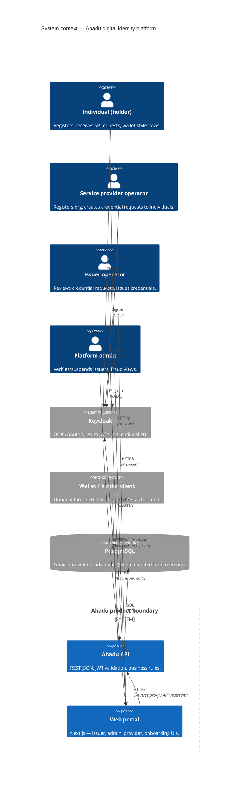

---

## 2. C4 Level 2 — Containers

Software inside the product boundary.

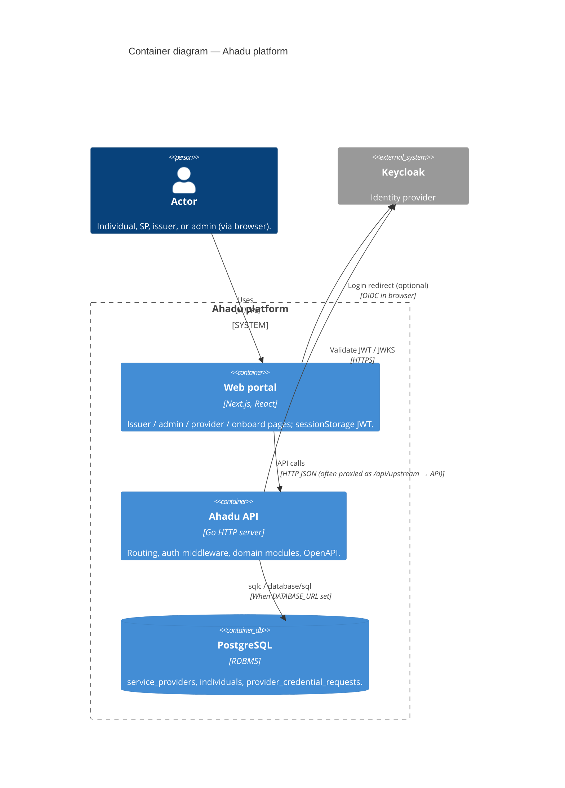

**Note:** When `DATABASE_URL` is unset, service-provider routes return **503**; much issuer/credential logic still uses **in-memory** storage inside the API process (no separate container).

**api2 codebase (persistence detail):** `individuals.Service` still **registers** holders in memory. When Postgres is enabled, `serviceprovider` can **resolve** a holder by Keycloak `sub` and validate `individual_id` against SQL **or** memory (`individualExists`), so compose-seeded or migrated individuals participate in SP flows alongside memory-only registrations. See **implementation-plan.md** §10 in the repository root (next to the `docs/` folder).

---

## 3. C4 Level 3 — Component diagram (Ahadu API)

Logical components inside the API (simplified).

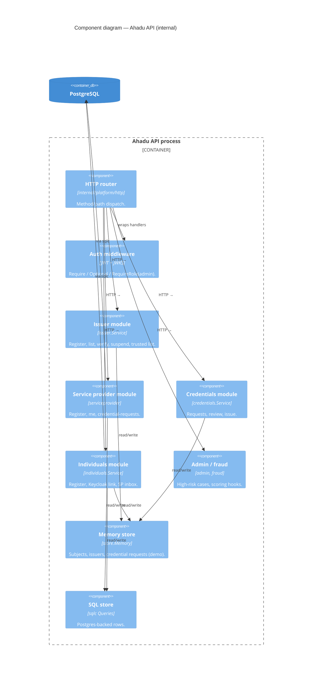

---

## 4. Sequence diagrams — Identity

### 4.1 Obtain access token (resource-owner style, dev / portal)

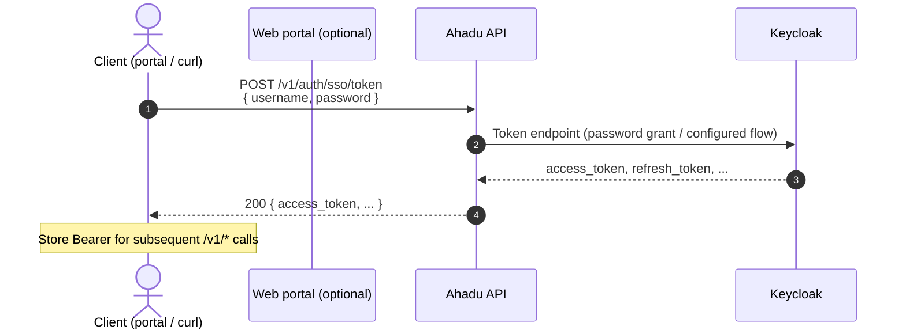

### 4.2 Call protected endpoint (JWT validation)

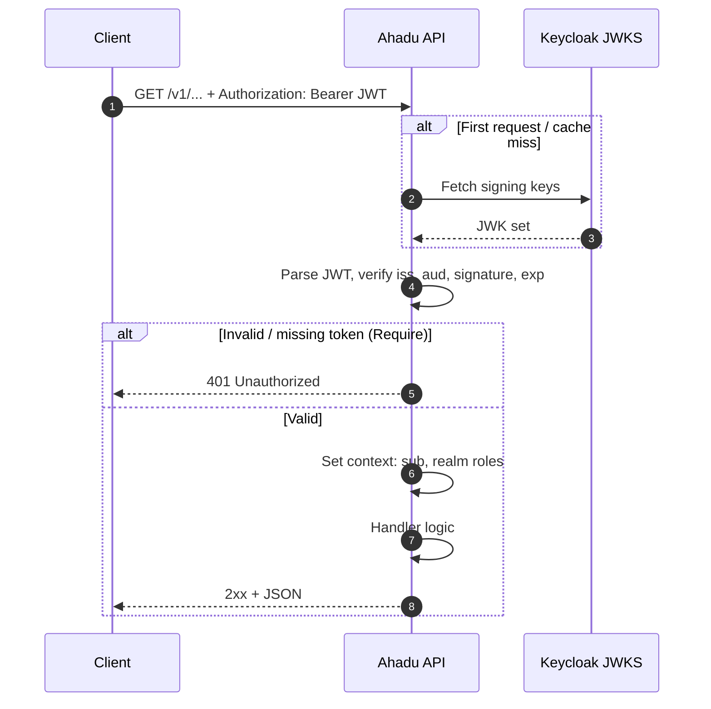

---

## 5. Sequence diagrams — Individuals (holders)

### 5.1 Individual self-registration (no Bearer)

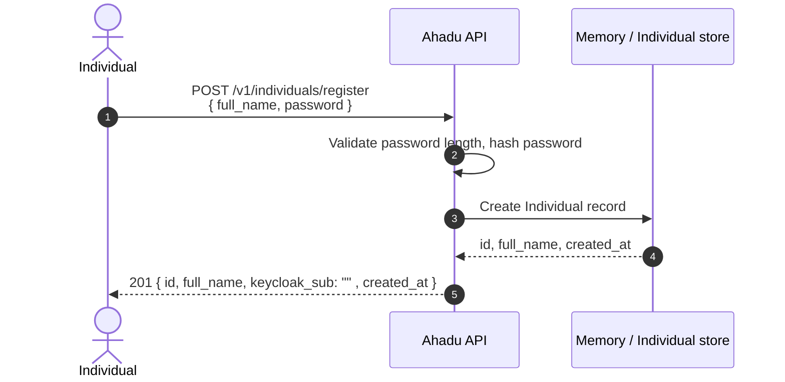

### 5.2 Individual registration with Bearer (link to Keycloak)

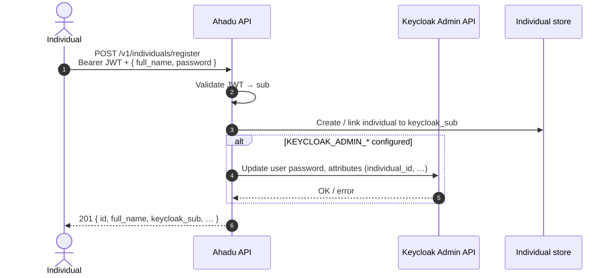

### 5.3 Individual — list SP credential requests (inbox)

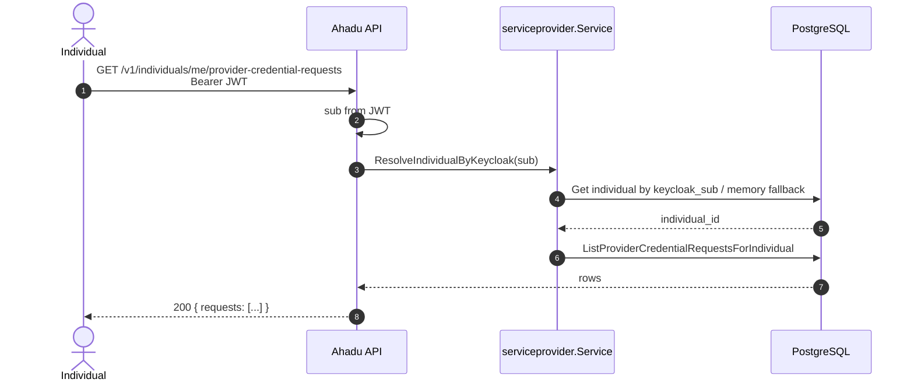

### 5.4 Individual — accept SP credential request

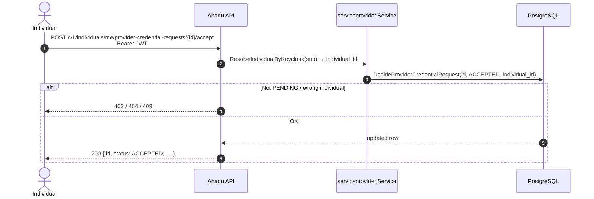

### 5.5 Individual — reject SP credential request

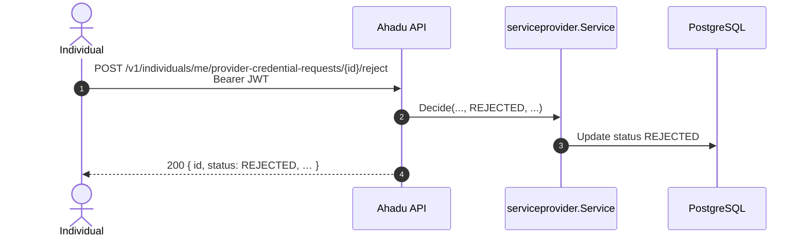

---

## 6. Sequence diagrams — Service providers

### 6.1 Service provider — public registration (no Bearer)

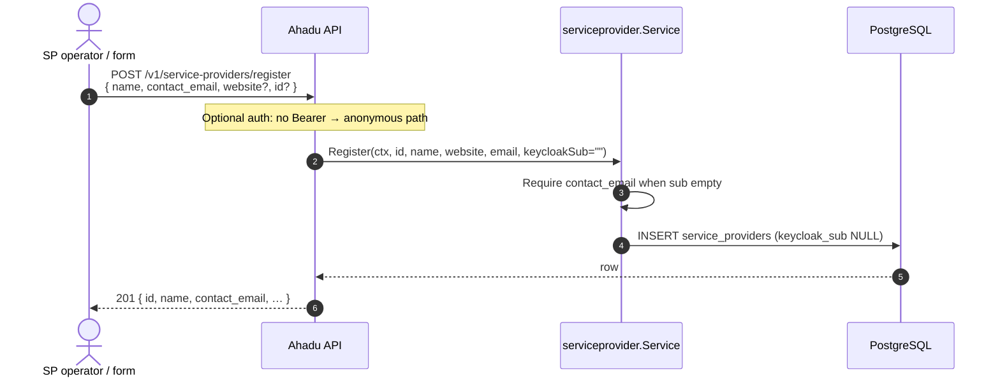

### 6.2 Service provider — authenticated registration (linked to Keycloak)

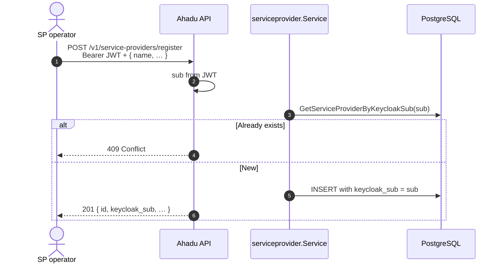

### 6.3 Service provider — create credential request to individual

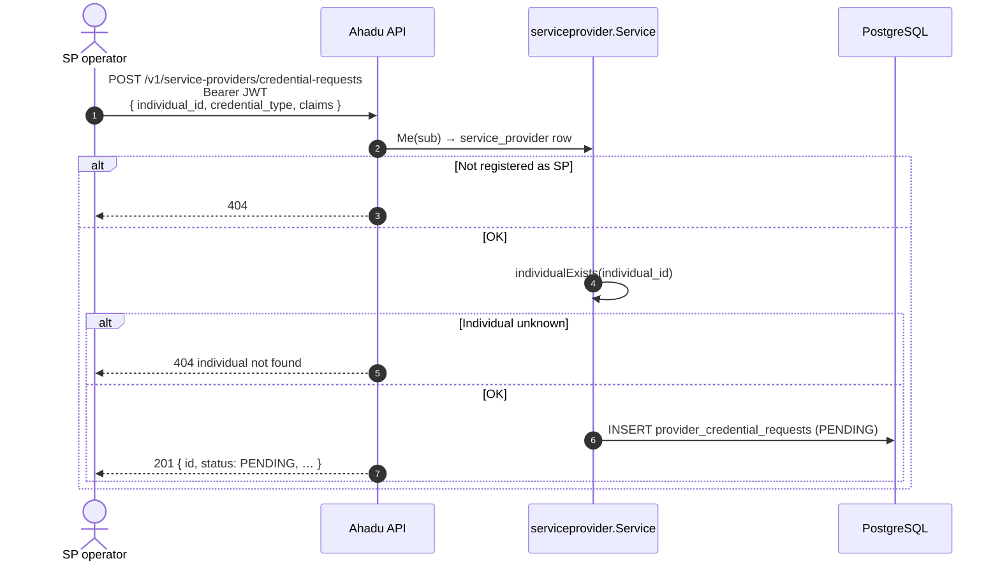

### 6.4 Service provider — list outgoing requests

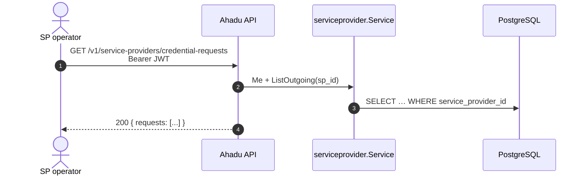

---

## 7. Sequence diagrams — Issuers & credential lifecycle (memory-backed)

*Typical demo path: subject creates wallet credential **request** targeting an issuer; issuer **reviews** and **issues**.*

### 7.1 Issuer self-registration

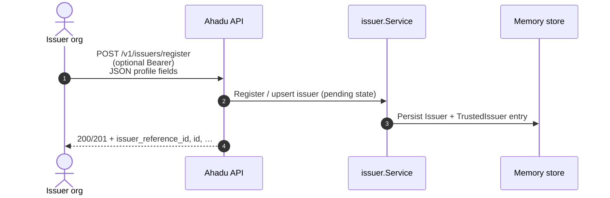

### 7.2 Credential request — create draft

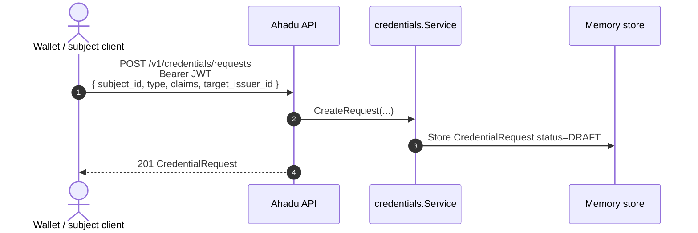

### 7.3 Credential request — submit for issuer review

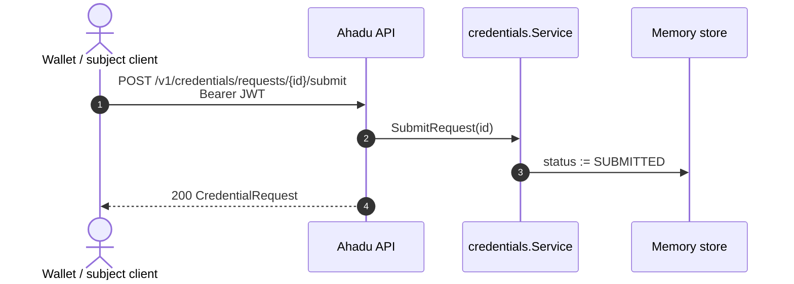

### 7.4 Issuer — review request (approve)

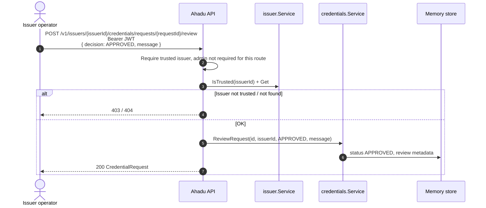

### 7.5 Issuer — issue credential after approval

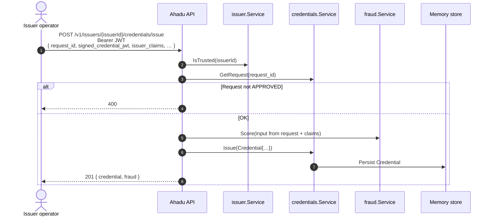

### 7.6 List credential requests (e.g. issuer queue / integration)

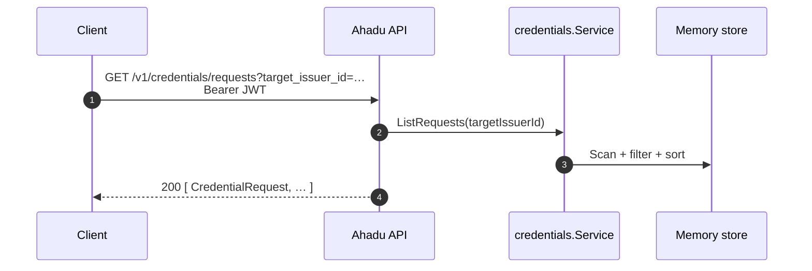

---

## 8. Sequence diagrams — Platform admin

### 8.1 Verify issuer (activate trusted issuer)

```mermaid
sequenceDiagram
  autonumber
  actor Adm as Platform admin
  participant API as Ahadu API
  participant Iss as issuer.Service
  participant Mem as Memory store

  Adm->>API: POST /v1/issuers/{id}/verify<br/>Bearer JWT (role admin)
  alt Not admin role
    API-->>Adm: 403
  else OK
    API->>Iss: Verify(id)
    Iss->>Mem: Issuer status/trusted flags
    API-->>Adm: 200 Issuer
  end
```

### 8.2 Suspend issuer

```mermaid
sequenceDiagram
  autonumber
  actor Adm as Platform admin
  participant API as Ahadu API
  participant Iss as issuer.Service

  Adm->>API: POST /v1/issuers/{id}/suspend<br/>Bearer JWT (admin)
  API->>Iss: Suspend(id)
  API-->>Adm: 200 Issuer
```

### 8.3 Admin — high-risk / fraud dashboard feed

```mermaid
sequenceDiagram
  autonumber
  actor Adm as Platform admin
  participant API as Ahadu API
  participant Fraud as fraud / admin module
  participant Mem as Memory store

  Adm->>API: GET /v1/admin/high-risk-cases<br/>Bearer JWT (admin)
  API->>Fraud: Aggregate cases / scores
  Fraud->>Mem: Read fraud events, subjects, …
  API-->>Adm: 200 { cases: … }
```

---

## 9. End-to-end — SP request + holder decision (happy path)

Combines sections 6 and 5 for a single vertical slice.

```mermaid
sequenceDiagram
  autonumber
  actor SP as SP operator
  actor H as Individual (holder)
  participant API as Ahadu API
  participant DB as PostgreSQL

  SP->>API: POST …/service-providers/register (linked)
  API->>DB: service_providers row
  H->>API: POST …/individuals/register (+ optional Keycloak link)
  API->>DB: individuals row
  SP->>API: POST …/credential-requests { individual_id, credential_type, claims }
  API->>DB: provider_credential_requests PENDING
  H->>API: GET …/me/provider-credential-requests
  API-->>H: lists pending request
  H->>API: POST …/provider-credential-requests/{id}/accept
  API->>DB: status ACCEPTED
  Note over SP,H: SP does not receive credential payload in this module alone;<br/>downstream wallet/OIDC flows would consume ACCEPTED state.
```

---

## 10. End-to-end — Issuer credential pipeline (happy path)

```mermaid
sequenceDiagram
  autonumber
  actor Adm as Admin
  actor Iss as Issuer operator
  actor W as Wallet client (subject)
  participant API as Ahadu API
  participant Mem as Memory store

  W->>API: POST /v1/credentials/requests (DRAFT)
  W->>API: POST /v1/credentials/requests/{id}/submit
  Adm->>API: POST /v1/issuers/{issuerId}/verify
  Iss->>API: POST …/credentials/requests/{id}/review APPROVED
  Iss->>API: POST …/credentials/issue
  API->>Mem: Credential stored
  API-->>Iss: credential + fraud hints
```

---

## 11. Related documents

| Doc | Purpose |
|-----|---------|
| [Features](features.md) | Actor capabilities vs HTTP surface |
| [Endpoint reference](endpoints-from-architecture.md) | All HTTP routes with auth, request, and response summary (aligned with OpenAPI) |
| Ahadu API repo | `api/openapi.yaml` — authoritative paths and schemas |
| Repo root | `implementation-plan.md` — phased engineering roadmap |

---

*Generated for engineering onboarding and stakeholder reviews. Adjust participants if you split the API into multiple deployables or add a dedicated API gateway.*

---

## 12. Optional — operator assistance (AI features)

This section documents **optional** integrations described in [features](features.md) under *Platform admin → Operator assistance*. It does **not** change the Ahadu API trust model: **verify/suspend** remain authoritative on the API with **admin** JWT and audit; external agents are **not** first-class components inside the API process.

### 12.1 C4 context — external agent (add-on view)

Supplements §1: an operator may use a **personal agent** (e.g. PicoClaw) for read-heavy assistance; it sits **outside** the Ahadu product boundary.

```mermaid
C4Context
title Context add-on — optional operator agent (read-mostly assist)

Person(platform_admin, "Platform admin", "Reviews and verifies issuers.")
System_Ext(ai_agent, "External AI agent", "e.g. PicoClaw: skills, HTTP tools, optional chat gateway.")
System(ahadu_api, "Ahadu API", "REST + JWT validation.")
System_Ext(keycloak, "Keycloak", "Issues admin JWT for verify.")

Rel(platform_admin, ai_agent, "Prompts / chat", "HTTPS or local CLI")
Rel(ai_agent, ahadu_api, "GET issuers (optional)", "HTTPS + Bearer when configured")
Rel(platform_admin, keycloak, "Sign-in", "OIDC")
Rel(platform_admin, ahadu_api, "POST verify", "HTTPS + admin Bearer")
Rel(ahadu_api, keycloak, "JWKS", "HTTPS")
```

### 12.2 Sequence — operator copilot (recommended)

Human remains the authority for `POST /v1/issuers/{id}/verify`; the agent may only **fetch and summarize** (or suggest checklists).

```mermaid
sequenceDiagram
  autonumber
  actor Human as Platform admin
  participant Agent as External agent (e.g. PicoClaw)
  participant API as Ahadu API

  Human->>Agent: Ask for summary of pending issuers
  Agent->>API: GET /v1/issuers (Bearer as configured)
  API-->>Agent: JSON list / details
  Agent-->>Human: Narrative summary, checklist, suggested questions
  Human->>API: POST /v1/issuers/{id}/verify (admin JWT)
  Note over Human,API: Verify is always issued by the operator (or separate workflow), not by model output alone.
```

### 12.3 Sequence — safe automation (deterministic gate)

If automation calls **verify**, only **programmatic** rules (policy engine, validated code paths) should allow it; **LLM judgment** must not be the sole approval criterion.

```mermaid
sequenceDiagram
  autonumber
  participant Job as Workflow / batch job
  participant Policy as Policy engine or rules (e.g. OPA)
  participant API as Ahadu API

  Job->>API: GET /v1/issuers (or internal listing of pending)
  API-->>Job: Issuer payloads
  loop Each candidate
    Job->>Policy: Evaluate structured facts (allowlist, format, registry, duplicates)
    Policy-->>Job: permit | deny
    opt permit
      Job->>API: POST /v1/issuers/{id}/verify (service/admin token, audited)
      API-->>Job: 200 Issuer
    end
  end
  Note over Job,API: Audit every automated verify; least-privilege tokens for the job identity.
```

### 12.4 Cross-reference

| Topic | Detail in [features](features.md) |
|-------|----------------------------------------|
| Operator copilot | *Platform admin → Operator copilot (recommended use)* |
| Safe automation | *Platform admin → Safe automation (if you insist)* |
