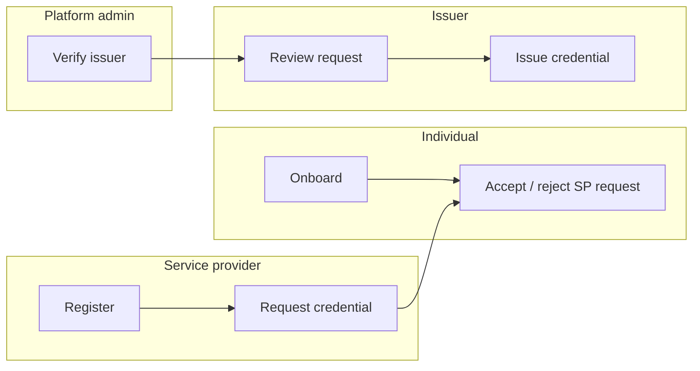

# Ahadu API — domain features (product view)

This document describes **who does what** in the wallet ecosystem and how the **Ahadu API** supports it today. It is written for product and engineering alignment; OpenAPI (`api/openapi.yaml`) remains the contract for request/response details.

**Shared prerequisites**

- **Identity:** Keycloak realm (e.g. `eudi-wallet`) issues JWTs; protected routes expect Bearer tokens with issuer/audience configured on the API (`KEYCLOAK_*`).
- **Persistence:** Several flows use an **in-memory** store for fast demos; **service providers** and **Postgres-backed individuals** require **`DATABASE_URL`** and migrations.

---

## 1. Service providers (relying parties)

**Intent (your product story)**

| Capability | Meaning |
|------------|---------|
| Self-registration | Organizations register as a service provider without mandatory platform approval (active SP row). |
| Request credentials | SP asks an **individual** for a credential type, with optional claims metadata. |
| Encrypted / selective disclosure (EUDI) | Holder wallet presents or receives credentials per **EU Digital Identity Wallet** / **OIDC4VCI**–style patterns (presentation, issuance). |
| Receive credentials if approved | After holder and issuer flows complete, SP may obtain agreed artifacts (today: API models and issuance hooks; full wallet crypto is integration-dependent). |
| Decline if not approved | If the holder does not consent, the SP does not get the credential. |

**What the API implements today**

| Step | Behavior | Primary HTTP surface |
|------|----------|----------------------|
| Register | Create `service_providers` row. **Optional auth:** anonymous onboarding requires `contact_email`; with Bearer, row is **linked** to JWT `sub`. | `POST /v1/service-providers/register` |
| Profile | Current SP for the logged-in Keycloak user. | `GET /v1/service-providers/me` |
| Request credential from individual | Creates **pending** provider credential request for a known `individual_id`. | `POST /v1/service-providers/credential-requests` |
| List outgoing requests | List requests for this SP. | `GET /v1/service-providers/credential-requests` |
| Holder sees requests | Individual’s inbox of SP requests. | `GET /v1/individuals/me/provider-credential-requests` |
| Holder accept / reject | **Individual** accepts or rejects (not the SP). Status becomes `ACCEPTED` / `REJECTED`. | `POST /v1/individuals/me/provider-credential-requests/{id}/accept` · `…/reject` |

**EUDI / encryption note**

- The API models **credential requests**, **credentials** (e.g. issued JWT payloads), **presentations**, and **consents** in line with wallet-style flows.
- **End-to-end encryption** and **full ARF / ISO 18013-5** compliance are **integration and wallet responsibilities**; this service exposes **HTTP resources and audit hooks** that align with those reference architectures rather than implementing the wallet binary protocols in-process.

**Gaps / clarifications**

- There is **no** separate “platform admin registers service provider” HTTP flow; admins would use DB/ops or a future admin API. SP creation is **self-service** via `POST /v1/service-providers/register`.
- Anonymous SP rows (`keycloak_sub` null) are **not** visible on `GET …/me` until linked to a Keycloak account (linking flow can be a future feature).

---

## 2. Issuers

**Intent**

| Capability | Meaning |
|------------|---------|
| Self-registration | Organization submits issuer application without admin pre-creating the row. |
| Verification claims | Incoming **credential requests** (wallet/subject-driven) represent work for the issuer to verify. |
| Review | Issuer (or operator) reviews evidence / policy and **approves** or **rejects** a submitted request. |
| Approve / reject | Decision is persisted on the credential request and can feed **issuance**. |

**What the API implements today**

| Step | Behavior | Primary HTTP surface |
|------|----------|----------------------|
| Self-register | Create issuer record (pending / onboarding fields depend on module; trusted list updated on verify). | `POST /v1/issuers/register` (optional Bearer) |
| List issuers | For authenticated callers with appropriate access patterns in product. | `GET /v1/issuers` |
| Get issuer | Detail by id. | `GET /v1/issuers/{id}` |
| Review credential request | Trusted issuer approves/rejects a **submitted** request with a required message. | `POST /v1/issuers/{issuerId}/credentials/requests/{requestId}/review` |
| Issue credential | After approval, issuer posts issuance payload (incl. signed credential JWT field, issuer claims); fraud scoring may run. | `POST /v1/issuers/{issuerId}/credentials/issue` |
| List credential requests | Filterable list for queue/integration (e.g. by `target_issuer_id`). | `GET /v1/credentials/requests` · `GET /v1/credentials/requests/{id}` |

**Credential request lifecycle (simplified)**

1. Create draft → submit (`POST /v1/credentials/requests`, `POST …/submit`).
2. Issuer **review** → `APPROVED` / `REJECTED`.
3. If approved → **issue** → credential stored / returned per module.

---

## 3. Platform admin

**Intent**

| Capability | Meaning |
|------------|---------|
| Flag issuer verified | Move issuer from pending to **trusted / active** so they can review and issue. |
| Register issuers / service providers | Back-office creation or override (product-dependent). |

**What the API implements today**

| Step | Behavior | Primary HTTP surface |
|------|----------|----------------------|
| Verify issuer | **Admin** role required; activates trusted issuer semantics. | `POST /v1/issuers/{id}/verify` |
| Suspend / deactivate | Operational controls on issuer state. | `POST /v1/issuers/{id}/suspend` · `…/deactivate` |
| List issuers | Often used from admin UI with admin JWT. | `GET /v1/issuers` |
| High-risk / fraud views | Admin dashboard data. | `GET /v1/admin/high-risk-cases` (and related fraud endpoints) |

**Gaps**

- **Issuer self-registration** is already public (`POST /v1/issuers/register`); admin **verifies**, rather than being the only registration path.
- **Service provider** creation is **not** exposed as an admin-only “create SP for user X” API in the current module; use **SP self-registration** or operational DB procedures until an admin API exists.

### Operator assistance (optional integrations)

External **AI agents** (e.g. [PicoClaw](https://github.com/sipeed/picoclaw)—a lightweight personal agent with skills and HTTP-capable tooling) are **outside** the Ahadu API trust boundary. They can **support** issuer approval **only** if integrated with strict scope and human or rule-based authority.

#### Operator copilot (recommended use)

- **Summarize and triage** pending issuer applications using **read-only** calls (`GET /v1/issuers`, `GET /v1/issuers/{id}`) via custom skills or scripts.
- Provide **checklists**, **draft questions** for compliance, and **alerts** when new pending issuers appear (e.g. scheduled jobs or chat notifications).
- **Decisions stay human-driven:** the operator (or existing admin UI) issues `POST /v1/issuers/{id}/verify` with an **admin** JWT (Keycloak `admin` role). The API responses and audit events remain the **system of record**.

#### Safe automation (if you insist)

- Allow **automatic verify** only behind **deterministic** rules implemented in **code or policy engines** (e.g. OPA): format validation, allowlists, duplicate checks, external registry lookups—not **LLM output alone** as approval authority.
- **Audit** every automated state change; use **short-lived**, **least-privilege** credentials; do not store long-lived admin secrets on shared or internet-exposed agent hosts without a threat model.
- For production-scale automation, prefer **workflow** or **policy-as-code** services; treat agents as a **UX / notification layer** on top, not as the trust root for verified issuer status.

---

## 4. Individuals (holders)

**Intent**

| Capability | Meaning |
|------------|---------|
| Onboard | Create wallet individual profile (and optionally link Keycloak). |
| Receive claim / credential requests | See requests from service providers (and other flows). |
| Share or refuse | Accept or reject SP credential requests; control consent and presentations in wallet-aligned flows. |

**What the API implements today**

| Step | Behavior | Primary HTTP surface |
|------|----------|----------------------|
| Register / onboard | Password + full name; optional Bearer links to Keycloak and can sync attributes. | `POST /v1/individuals/register` |
| Me | Resolve current individual from Keycloak `sub` (when linked). | `GET /v1/individuals/me` |
| Get by id | Lookup internal individual id (protected). | `GET /v1/individuals/{id}` |
| SP requests inbox | List pending/completed SP credential requests for this holder. | `GET /v1/individuals/me/provider-credential-requests` |
| Accept / reject SP request | Holder decision on a specific request id. | `POST /v1/individuals/me/provider-credential-requests/{id}/accept` · `…/reject` |
| Wallet credentials | List issued credentials for a subject id (wallet-style path). | `GET /v1/wallets/{subjectId}/credentials` |
| Consents / presentations / privacy | Supporting holder-centric flows. | `POST /v1/consents` · `POST /v1/presentations/*` · `POST /v1/privacy/*` |

---

## 5. Cross-actor summary

---

## 6. Related docs

- [architecture-and-flows.md](./architecture-and-flows.md) — **C4** (context, container, component) and **sequence diagrams** for all major flows.
- [registration-api.md](registration-api.md) — individuals & issuers registration details (if present beside this doc).
- [keycloak-sso.md](keycloak-sso.md) — SSO and tokens.
- [../README.md](../README.md) — run, compose, env vars.
- `api/openapi.yaml` — full route list and schemas.

---

*Document version: aligned with the Ahadu API module layout and routes as of the repo state when this file was added. Update this doc when you add admin SP provisioning, Keycloak linking for anonymous SPs, or new wallet endpoints.*
