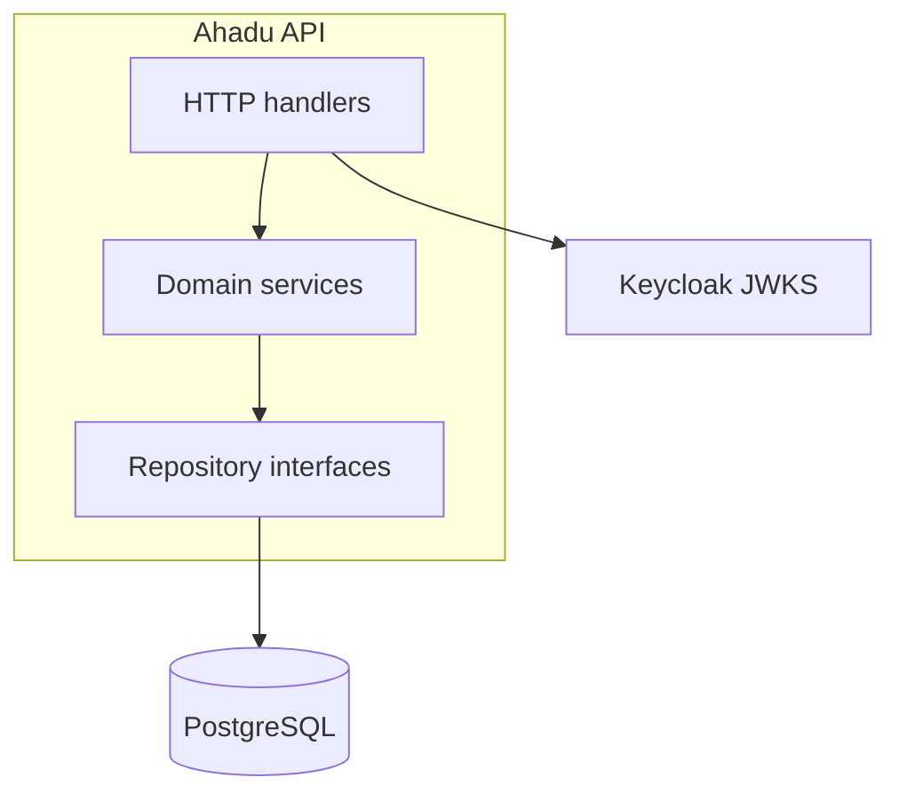

# Ahadu API — implementation plan (Go, PostgreSQL, PicoClaw)

This plan turns the **target architecture** in [architecture-and-flows.md](./architecture-and-flows.md) and the **product surface** in [features.md](./features.md) into an ordered engineering roadmap. It assumes the **Ahadu API** remains a Go HTTP service (`/v1/*`), **PostgreSQL** becomes the system of record for all durable domain data, and **PicoClaw** is used as an **operator-facing assistant** (skills / MCP / HTTP) rather than as the trust root for approvals.

**References**

- C4 + sequences: [architecture-and-flows.md](./architecture-and-flows.md)
- Domains and gaps: [features.md](./features.md)
- HTTP surface (tables): [endpoints-from-architecture.md](./endpoints-from-architecture.md)
- Contract: [api/openapi.yaml](./api/openapi.yaml) (paths and schemas)

---

## 1. Goals and non-goals

**Goals**

1. **Single durable store:** Replace in-memory `store.Memory` usage for production-critical entities with **PostgreSQL** + **sqlc**, behind repository interfaces the modules already conceptually use.
2. **Same external contract:** Preserve existing HTTP routes and JSON shapes unless a versioned breaking change is explicitly approved.
3. **Identity unchanged:** Keep **Keycloak** JWT validation (JWKS, roles) as today; no replacement of OIDC with PicoClaw.
4. **PicoClaw in the loop safely:** Use PicoClaw for **read-heavy assistance**, notifications, and **draft** content; **human or policy-gated** steps for `verify`, `review`, and destructive actions (as already described in [features.md](./features.md) §3).

**Non-goals (initial phases)**

- Implementing full EUDI wallet binary protocols or ARF compliance inside the API (remain HTTP + audit hooks).
- Letting LLM output alone call admin-only or issuer decision endpoints without explicit human confirmation or deterministic policy.

---

## 2. Technology choices

| Area | Choice | Notes |
|------|--------|--------|
| Language | **Go** (1.22+ recommended) | Match existing `api` module. |
| Database | **PostgreSQL** | Required for SP + individuals today; extend to issuers, credential requests, credentials, audit, etc. |
| DB access | **sqlc** + `database/sql` | Already present under `internal/platform/store/sqlc`; extend queries and migrations. |
| Migrations | **golang-migrate** CLI (same family as `migrate/migrate` Docker image) | **api2:** `docker-compose.yml` runs `migrate/migrate` against `./migrations`; see [README.md](./README.md). |
| HTTP | Existing `internal/platform/http` router | Keep thin handlers; push logic into services. |
| PicoClaw | **External process** (agent + MCP / channels) | See §7; do not treat PicoClaw as mandatory inside the API binary unless you have a concrete embedding requirement. |

**Note on “PicoClaw as library”**

PicoClaw ([github.com/sipeed/picoclaw](https://github.com/sipeed/picoclaw)) is primarily a **standalone assistant** (MCP, messaging channels, tool use). The practical integration for Ahadu is:

- **Recommended:** Run PicoClaw **beside** the stack; give it **tools/skills** that call Ahadu’s **REST API** (or an MCP server that wraps those calls).
- **Optional:** If a **reusable Go package** is published for embedding, evaluate it for a **small sidecar** (e.g. notification worker), not for merging into the main API without a threat model.

---

## 3. Target architecture (post-migration)

Align the **component diagram** in [architecture-and-flows.md](./architecture-and-flows.md) §3 with reality:

- **Router + auth middleware** — unchanged.
- **Domain modules** (`issuer`, `credentials`, `individuals`, `serviceprovider`, `admin`, `fraud`, `audit`, …) — depend on **repository interfaces**.
- **Postgres repositories** — implement those interfaces via **sqlc** `Queries` + transactions.
- **Memory** — shrink to: tests, local dev without `DATABASE_URL`, or explicit feature flags; production paths require `DATABASE_URL`.

---

## 4. Phased delivery

### Phase A — Inventory and boundaries (short)

1. **Enumerate** every type still in `store.Memory` vs already in SQL (compare `internal/platform/store/memory.go` and sqlc queries).
2. **Define repository interfaces** per aggregate (e.g. `CredentialRequestRepository`, `IssuerRepository`, `CredentialRepository`, `SubjectRepository`, `AuditRepository`).
3. **Map** each `POST`/`GET`/`PATCH` in `internal/app/router.go` to the aggregate it touches (single table of “route → service → store”).

**Exit criteria:** Signed-off list of tables and modules for Phase B; no schema yet.

---

### Phase B — Schema design and migrations (PostgreSQL)

Design tables to match **current JSON** and **in-memory structs** (see `store.CredentialRequest`, `Issuer`, etc. in `memory.go` and OpenAPI), including:

| Domain | Suggested tables (illustrative) | Priority |
|--------|--------------------------------|----------|
| Issuers | `issuers`, issuer status / trust flags | High (gates review/issue) |
| Credential requests | `credential_requests` (lifecycle DRAFT → SUBMITTED → APPROVED/REJECTED) | High |
| Credentials | `credentials` (issued artifacts, links to request + issuer) | High |
| Subjects / identities | `subjects` (if still needed alongside individuals) | Medium |
| Audit | `audit_events` (actor, action, resource, payload hash) | High for compliance |
| Existing | `service_providers`, `individuals`, `provider_credential_requests` | Already in motion |

**Practices**

- **UUID or prefixed IDs** consistent with current API (`randomID` prefixes).
- **Timestamps** UTC; `reviewed_at`, `created_at`, `updated_at` where applicable.
- **Foreign keys** from credential_requests → issuers (target), credentials → requests.
- **Indexes** for list endpoints (`target_issuer_id`, `status`, `created_at`).

**Exit criteria:** Migrations apply cleanly on empty DB; seed data script or Go seed compatible with docker-compose Postgres.

---

### Phase C — sqlc and repository implementation

1. Add `.sql` queries under `internal/platform/store/sqlc/queries/` for CRUD and list operations.
2. Run `sqlc generate`; wire `*sqlc.Queries` with `*sql.DB` (or `*sql.Tx`) in a `postgres` package.
3. Implement **transactions** for multi-step operations (e.g. review + audit append; issue + fraud log).
4. **Feature flag or build tag** (optional): `DATABASE_URL` required in prod; memory fallback only for dev/tests.

**Exit criteria:** Integration tests against Postgres (use testcontainers or CI service container) for at least: credential request create/submit/review/issue; issuer verify trusted path.

---

### Phase D — Wire router to Postgres-backed services

1. Replace `credentials.Service` memory map with repository injection (constructor takes `CredentialRequestRepo`, `CredentialRepo`).
2. Same pattern for **issuer**, **audit**, and any remaining memory users on hot paths.
3. Keep **handler signatures** stable; adjust only internals and error mapping (404/409/403).
4. Update **docker-compose** and **README** so default dev path uses Postgres for all migrated modules.

**Exit criteria:** With `DATABASE_URL` set, portal flows (issuer queue, review, issue) work without in-memory credential store.

---

### Phase E — Hardening

1. **Idempotency** where clients retry (e.g. optional `Idempotency-Key` header on POST issue — future).
2. **Rate limiting** on public registration endpoints.
3. **Structured logging** (request id, sub, route); **metrics** (latency, 4xx/5xx by route).
4. **Backup / restore** runbook for Postgres.

---

## 5. Auth and authorization (unchanged pattern)

- **JWT:** Continue JWKS cache, `sub`, realm roles (`admin`, etc.).
- **Authorization rules** stay in handlers/services: e.g. issuer review requires `IsTrusted(issuerId)`; admin verify requires `admin` role.
- **Service accounts** (optional): For automation, use Keycloak clients with **narrow roles** and short-lived tokens — not shared user passwords.

---

## 6. Portal and contract alignment

- Regenerate or hand-update **OpenAPI** when request/response bodies gain fields (e.g. audit ids).
- **Web portal** (`../web/portal`): already proxies to API; after Postgres migration, ensure list/review endpoints return the same shapes (snake_case JSON as today).

---

## 7. PicoClaw integration plan

**Positioning (from [features.md](./features.md)):** PicoClaw sits **outside** the API trust boundary. It **assists** operators; it does not replace Keycloak or business policy.

### 7.1 Recommended integration shape

1. **Deploy PicoClaw** on an operator-controlled host (or shared dev environment).
2. **Implement Ahadu “skills”** (PicoClaw skill files or MCP tools) that:
   - Use **read-only** GETs where possible: e.g. `GET /v1/issuers`, `GET /v1/credentials/requests?target_issuer_id=…`.
   - For **mutating** calls (`POST …/verify`, `POST …/review`), require **explicit human confirmation** in the skill (e.g. “reply YES to approve”) or **do not expose** those tools in production agents.
3. **Credentials:** Use a **dedicated Keycloak user** or client credential with **least privilege**; never embed long-lived admin tokens in public repos.
4. **Audit:** Log agent-initiated calls like any other client (subject = service account or operator’s JWT).

### 7.2 Optional: MCP server in Go

If you want a **small Go binary** that PicoClaw talks to via MCP:

- New module or `cmd/mcp-ahadu` that exposes tools: `list_pending_issuers`, `get_issuer`, `list_credential_requests` — each tool forwards to Ahadu REST with server-side token from env.
- Keeps PicoClaw config simple and centralizes URL + auth.

### 7.3 What “using PicoClaw as a library” should mean in practice

- **Prefer:** PicoClaw **binary + skills**, Ahadu **unchanged** API.
- **Avoid:** Importing PicoClaw core into the monolith **unless** you need embedded agent behavior inside the same process — that increases attack surface and deployment coupling.

---

## 8. Risks and mitigations

| Risk | Mitigation |
|------|------------|
| Schema drift from OpenAPI | Generate types or contract tests; single source of truth in migrations + OpenAPI. |
| Long migration from memory | Strangler: migrate one aggregate at a time; dual-write or read-from-SQL-fallback during cutover. |
| PicoClaw over-privileged | Separate realm roles; read-only default tools; human-in-the-loop for mutations. |
| Performance on lists | Indexes; pagination cursors on `GET /v1/credentials/requests` (future). |

---

## 9. Milestone checklist (summary)

**Target state** (full Postgres for production-critical paths):

- [ ] Phase A: memory vs SQL inventory + repository interfaces  
- [ ] Phase B: Postgres schema + migrations for issuers, credential_requests, credentials, audit  
- [ ] Phase C: sqlc queries + repo impl + integration tests  
- [ ] Phase D: wire `router.go` services to Postgres; deprecate memory for those paths  
- [ ] Phase E: observability, rate limits, ops docs  
- [ ] PicoClaw: skills/MCP for read-only triage; documented token model  
- [ ] Update [architecture-and-flows.md](./architecture-and-flows.md) diagram notes (“Memory” → “Postgres” where migrated)

---

## 10. api2 execution status (honest)

This section records how the **api2** tree matches the plan **as implemented in code**, so expectations stay aligned with [architecture-and-flows.md](./architecture-and-flows.md) §2–3.

| Plan item | Status | Notes |
|-----------|--------|--------|
| **§1 Goal: single durable store** | **Partial** | Only **service providers** and **provider credential requests** are always Postgres-backed when `DATABASE_URL` is set. Issuer, wallet credential requests, credentials, audit, consent, presentation, KYC, fraud events, subjects, and **individual registration** still use `store.Memory`. |
| **Phase A** | **Implicit** | No separate signed-off inventory doc; route → module mapping lives in `internal/app/router.go`. |
| **Phase B** | **Partial** | `migrations/` + `db/schema.sql` include tables for credentials, issuers, audit, individuals, etc.; **not all** are exercised by live services. |
| **Phase C** | **Partial** | sqlc output is under `internal/platform/store/sqlc/`; **wired in production path** mainly for `serviceprovider` (+ SQL reads for individual resolution / existence checks used by SP). |
| **Phase D** | **Partial** | `cmd/api/main.go` opens Postgres only for `serviceprovider.New(sqlc, individualsSvc)`. `credentials`, `issuer`, `individuals` (writes), `audit`, etc. remain memory-backed. |
| **Phase E** | **Not started** | No rate limiting / structured request logging / metrics in-tree. |
| **§5 Auth** | **Done** | JWKS JWT middleware unchanged; admin routes use realm role checks. |
| **§6 Contract** | **Done** | `api/openapi.yaml` ships with api2; SSO routes wired (`/sso`, `/v1/auth/sso`, `/v1/auth/sso/token`). |
| **§7 PicoClaw** | **N/A in repo** | By design: external agent + skills; no PicoClaw binary or MCP server in this module. |

**Bottom line:** api2 **fully implements the HTTP contract and flows** described in the architecture docs for routes that exist, but the **persistence migration** in §3 and Phases B–D is **only complete for the service-provider aggregate**. Completing the plan means wiring issuer, credentials, audit, and individuals **writes** through Postgres repositories (and adding integration tests per Phase C exit criteria).

---

## 11. Related documents

- [architecture-and-flows.md](./architecture-and-flows.md) — C4 and sequences (source of truth for flows)  
- [features.md](./features.md) — Actor capabilities and PicoClaw safety notes  
- [README.md](./README.md) — run, env vars, compose  

---

*Version: 1.1 — adds §10 execution status for the api2 codebase (2026-03-27). Milestones in §9 remain the target until Phases A–D are closed.*
